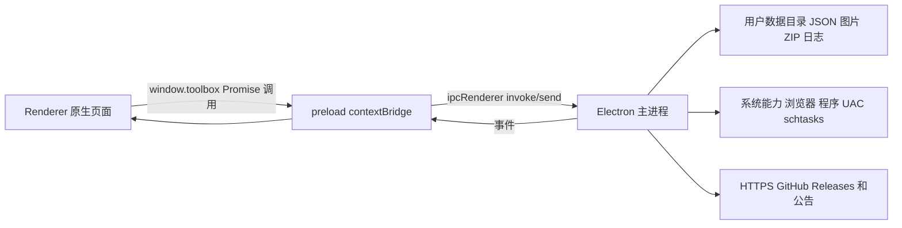

# 阿洁的旅行工具箱架构与接口规范

> 文档状态：当前实现基线。
> 应用版本：`0.1.0-beta.2`。
> 适用代码：`apps/desktop/electron/main.cjs`、`apps/desktop/electron/preload.cjs`、`apps/desktop/renderer/`、`runtime-template/` 与 `scripts/`。
> 最后核对：2026-09-18。

本文档是阿洁的旅行工具箱（JaeTravelToolbox）的唯一架构说明与内部接口契约。它描述当前已经落地的能力、文件格式、Electron IPC 接口、发布边界和兼容性要求。没有明确标为“规划”的内容均应以当前代码实现为准。

## 0. 设计演进与仍有效的决策

项目早期设计文档已合并至本节，原文件不再保留。以下决策仍然有效：

- 产品坚持本地优先：即使未来增加账号、同步、分享或在线目录，本地 JSON、ZIP 配置包和不联网的核心管理能力仍应可独立运行。
- 当前不建设后端服务；当在线能力确有需求时，再单独设计 Node.js + TypeScript + NestJS + PostgreSQL 服务，并保持与桌面应用的接口边界清晰。
- 工具箱只管理项目入口、配置和受控资源包，不修改用户自行添加的工具，也不替用户更新其自行配置的第三方程序。
- 管理员启动和自定义 CMD 命令是面向可信来源的高级能力。配置包可携带其定义，但导入和查看配置均不得自动执行任何目标或命令。
- 工程目录、配置格式和发布产物使用英文文件名；中文仅作为面向用户的展示文本。项目相对路径以工具箱根目录为基准，推荐使用 `/` 分隔符。

## 1. 产品边界和当前状态

阿洁的旅行工具箱是本地优先的《明日方舟》相关网站、本地程序、文件夹和资料入口管理器。一个项目统一抽象为 `Item`；项目由名称、启动目标、简介、图标、分类、收藏和可选高级启动配置构成。

当前已实现：项目与分类管理、拖拽排序、中文/拼音/英文模糊搜索、配置源、`.attconfig` 导入导出、托管图标与背景、Windows 定时任务、全局快捷键、快捷轮盘、公告、日志、更新检查，以及独立本地工具资源包的安装框架。

当前边界如下：

- 应用架构可跨平台运行；管理员启动、CMD 自定义命令和 Windows 任务计划仅支持 Windows。
- 没有 HTTP REST 服务、云端账户、同步服务或数据库。所有主业务数据均为本地 JSON 与 ZIP。
- `tools/` 不纳入 Git，也不再进入 NSIS 安装包。默认本地工具通过独立 ZIP 工具资源包分发。
- 默认配置源本地工具包会从 GitHub Releases 自动发现并下载；GitHub 查询失败或未发现兼容包时，界面必须提示原因，用户仍可选择本地 ZIP 安装。
- GitHub 更新源已指向 `ganhong1/JaeTravelToolbox`，但真正自动更新还要求发布与当前版本匹配的 NSIS 更新元数据和安装包。

## 2. 技术栈和架构

| 层 | 当前技术 | 责任 |
|---|---|---|
| 桌面容器 | Electron | 主窗口、无边框轮盘窗口、系统对话框、全局快捷键、协议、文件和进程能力 |
| 主进程 | Node.js CommonJS | 业务逻辑、持久化、ZIP、启动、Windows 定时任务、更新和日志 |
| preload | Electron `contextBridge` | 向页面暴露最小化 `window.toolbox` 异步接口 |
| 渲染层 | Vite + 原生 HTML/CSS/JavaScript | 页面、卡片、弹窗、搜索、拖拽、Markdown 渲染 |
| 搜索 | Fuse.js + pinyin-pro | 中文、拼音、英文及目标文件名模糊检索 |
| Markdown | marked + DOMPurify | 使用教程、公告和更新说明的安全渲染 |
| 归档 | archiver + unzipper | `.attconfig` 与工具资源包 ZIP 的构建、读取和校验 |
| 日志 | Pino | 五级结构化运行日志和 TXT 导出 |
| Windows 打包/更新 | electron-builder NSIS + electron-updater | 安装包构建、GitHub Releases 更新检查与安装 |

渲染层使用原生 `<dialog>` 作为模态框。操作气泡默认挂在主页面右上角；当任意模态框打开时，气泡容器会自动移动到最顶层的模态框内部，因此其显示层级始终高于设置、更新、资源包等对话框。模态框关闭后，容器自动回到主页面。该迁移不改变气泡队列、自动消失时长或手动关闭行为。



安全隔离规则：渲染层启用 `contextIsolation`，关闭 `nodeIntegration`，不直接接触 Node.js、文件系统、`child_process` 或 Electron 原生对象。所有特权操作均从 preload 白名单进入主进程。

## 3. 运行模式、目录和生命周期

### 3.1 根目录规则

| 运行模式 | `dataRoot`（用户可变数据） | 应用模板 |
|---|---|---|
| 源码开发 | 工程根目录 | 工程内 `runtime-template/` |
| NSIS 安装版 | 安装根目录 `data/` | `app/resources/app.asar` 内的 `runtime-template/` |
| 旧便携兼容路径 | `PORTABLE_EXECUTABLE_DIR` | 应用内模板 |

安装根目录只保留 `JaeTravelToolbox.exe`（无控制台启动器）和 `Uninstall JaeTravelToolbox.exe`；Electron 运行时文件收纳在 `app/`，可变数据和 Chromium 缓存收纳在 `data/`。启动器将参数原样转发给 `app/JaeTravelToolbox.Runtime.exe`，并以安装根目录为工作目录。

项目相对目标的查找顺序为：`dataRoot/<target>`、工具箱根目录 `<target>`、安装版 `app/resources/<target>`。`http://` 或 `https://` 是网站；其余目标均为本地目标。推荐相对路径一律使用 `/`，例如 `tools/MAA/MAA.exe`。

### 3.2 用户数据目录

```text
<dataRoot>/
├─ config/
│  ├─ sources.json
│  ├─ sources/<source-id>/{categories.json,item-order.json,wheel-layout.json,schedules.json}
│  ├─ shortcuts.json
│  ├─ background.json
│  ├─ update-settings.json
│  ├─ announcement-cache.json
│  ├─ announcement-state.json
│  ├─ initialization.json
│  └─ tool-pack.json
├─ items/<source-id>/<item-id>.json
├─ static/images/custom/{项目图标,backgrounds/背景图片}
├─ tools/
└─ logs/runtime-YYYY-MM-DD.ndjson
```

从旧版安装包首次升级时，程序会在启动前把旧 Electron `userData` 目录中的 `config/`、`items/`、`static/` 与 `tools/` 复制到新的 `data/`，逐文件按相对路径和大小验证，再删除旧目录中的全部数据（包括可安全重建的 Chromium 缓存）。若目标目录已存在或校验失败，旧数据不会删除，且主窗口会提示用户处理迁移。NSIS 自动更新始终保留安装根目录的 `data/`；交互式卸载会询问用户是否保留，默认保留。静默卸载同样默认保留，只有传入 `--delete-user-data` 才会一并删除。

首次启动会创建目录、建立默认配置源，并导入内置 `default-source.attconfig` 中尚未存在的默认项目。默认源通过归档 SHA-256 指纹判断是否已处理；更新默认源时只补充缺失项目，不覆盖用户已有项目。

运行日志为半持久化：本次运行写入 NDJSON；下次启动会清除旧的 `runtime-YYYY-MM-DD.ndjson`，仅保留当前运行日志。用户手动导出的 TXT 不会自动删除。

## 4. 核心模型与本地格式

### 4.1 标识符和通用规则

- `ItemId` 与自定义 `SourceId`：26 位 ULID，字符集为 Crockford Base32。
- 默认配置源 ID 固定为 `default`，不可删除。
- “全部”“收藏”是虚拟分类，不写入 `categories.json`，也不可作为用户分类保存。
- 所有 JSON 以 UTF-8 写入，使用“写临时文件后 rename”的方式降低中断导致半写入的风险。
- 新字段必须提供安全默认值。读旧数据时，缺失字段不得阻止其余数据使用。

### 4.2 Item

文件：`items/<source-id>/<item-id>.json`

```json
{
  "image": "static/images/custom/01ABC...png",
  "name": "MAA",
  "target": "tools/MAA/MAA.exe",
  "description": "工具简介，允许换行。",
  "category": "日常",
  "favorite": false,
  "advancedLaunchEnabled": false,
  "commandLaunches": [
    {
      "id": "01ABC...",
      "name": "调试启动",
      "command": "tools/MAA/MAA.exe --debug"
    }
  ]
}
```

约束：

- `name` 和 `target` 必填；`description`、`category`、`image` 可为空。
- `image` 仅自动托管 `static/images/custom/<文件名>`。支持 PNG、JPG/JPEG、WebP、GIF、BMP、ICO。
- `commandLaunches` 最多 20 条；名称最多 64 字符，命令最多 4096 字符。
- 高级启动关闭时，命令仍保留但前端隐藏。CMD 命令在 Windows 上以 `cmd.exe /d /s /c` 执行，工作目录为 `dataRoot`。
- 保存替换图标或删除项目后，若旧托管图标未被任何配置源项目引用，将自动删除。

### 4.3 配置源、分类和排序

`config/sources.json`：

```json
{
  "version": 1,
  "activeSourceId": "default",
  "sources": [
    { "id": "default", "name": "默认配置源", "isDefault": true },
    { "id": "01ABC...", "name": "日常使用", "isDefault": false }
  ]
}
```

每个配置源拥有下列独立文件：

| 文件 | 格式与规则 |
|---|---|
| `categories.json` | `{ "version": 1, "categories": ["日常"] }`；名称去重，排除“全部”“收藏” |
| `item-order.json` | `{ "version": 1, "order": ["<item-id>"] }`；必须恰好覆盖该源所有项目 |
| `wheel-layout.json` | `{ "version": 1, "center": null, "outer": [null, ...] }`；圆心 1 项、外圈固定 9 项 |
| `schedules.json` | `{ "version": 1, "schedules": [] }`；定时任务属于配置源 |

新建配置源可选择继承默认源。继承会复制项目、分类、轮盘布局；定时任务也会复制，但强制设为 `enabled: false` 且 `wakeToolbox: false`。

### 4.4 定时任务

```json
{
  "id": "01ABC...",
  "name": "每日日常",
  "sourceId": "default",
  "cron": "0 9 * * *",
  "enabled": true,
  "wakeToolbox": true,
  "runOnStartup": false,
  "repeatEveryMinutes": 0,
  "steps": [
    { "itemId": "01DEF...", "elevated": false, "delayAfterSeconds": 10 }
  ],
  "updatedAt": "2026-09-17T00:00:00.000Z"
}
```

Cron 为五段式“分 时 日 月 周”。每步间隔范围为 0–3600 秒，重复范围为 0–1440 分钟。`wakeToolbox` 启用时，主进程仅将可转换的规则同步到 Windows `schtasks.exe`；复杂 Cron 必须关闭该选项或改用简易规则。任务并发时进入串行队列；同一任务运行或排队期间不会重复加入。

### 4.5 本机快捷键与背景

`config/shortcuts.json` 只属于本机，不随配置源导出：

```json
{
  "version": 2,
  "enabled": true,
  "sourceId": "default",
  "wheelEnabled": true,
  "wheelShortcut": "Control+F2",
  "wheelSize": 760,
  "wheelAnchor": "center",
  "wheelOffsetX": 0,
  "wheelOffsetY": 0,
  "itemShortcuts": { "default:01ABC...": "Control+1" }
}
```

轮盘槽位布局属于配置源，位置、尺寸与全局快捷键属于本机。轮盘窗口为独立、透明、无边框、置顶 Electron 窗口；再次按唤起键、按 Esc、右键或失焦会隐藏。

`config/background.json`：`current` 为当前托管背景路径，`history` 为最多 10 项的历史路径。保存、切换或重置后会删除既不在当前项也不在历史项的背景托管文件。

### 4.6 在线服务与更新偏好

内置 `runtime-template/config/online-services.json`：

```json
{
  "version": 1,
  "announcement": { "url": "", "timeoutSeconds": 8 },
  "updater": { "provider": "github", "owner": "ganhong1", "repo": "JaeTravelToolbox", "channel": "latest" },
  "toolPack": { "provider": "github-release", "channel": "auto", "maxSizeMiB": 2048 }
}
```

公告和工具资源包 URL 只接受 HTTPS。远程公告固定由仓库 `content/announcement.md` 提供，正文图片使用同仓库 `content/images/` 的 GitHub Raw 绝对 HTTPS URL；程序仍保留内置公告和最近成功缓存作为离线回退。更新偏好保存于 `config/update-settings.json`：`source`、`checkOnLaunch`、`autoDownload`、`autoInstallOnQuit`；当前 `source` 仅允许 `github-release`，但 UI 与数据结构已为未来官方镜像预留。开发模式不检查更新；安装版更新检查超时为 15 秒，失败不会阻塞主界面。

更新下载状态包含 `progress`、`transferred`、`total` 与 `bytesPerSecond`。下载由 `electron-updater` 的 `CancellationToken` 控制；用户取消后由更新器清理临时下载文件，主进程复位状态并记录取消事件。当前不提供伪暂停或断点续传。

## 5. `.attconfig` 配置包契约

`.attconfig` 是 UTF-8 ZIP，而不是自定义二进制格式。导出内容如下：

```text
manifest.json
categories.json
item-order.json
wheel-layout.json
schedules.json
items/<source-item-id>.json
images/<托管图片文件名>
```

`manifest.json` 至少包含 `version`、`source.name`、`exportedAt`、`itemCount`。导出不包含工具程序、日志、背景、本机快捷键、轮盘位置/尺寸或应用程序本体。

导入模式：

| 模式 | 行为 |
|---|---|
| `incremental` | 默认。创建新配置源，名称冲突时追加“（2）”等后缀 |
| `merge` | 合入当前自定义源，保留现有排序并追加导入项目 |
| `overwrite` | 替换当前自定义源的项目和分类；先取消该源 Windows 任务计划 |

导入时会重新生成项目 ID 和图标文件名，避免与现有数据冲突；轮盘和定时任务会将旧项目 ID 映射为新项目 ID。导入的所有任务均强制暂停，不会自动创建 Windows 计划任务。缺少分类、排序、轮盘、任务或新字段的旧配置包可导入并使用空默认值；单个损坏项目会跳过并记录警告。

## 6. 独立工具资源包

### 6.1 当前格式

构建命令：`npm run package:tools`。输出目录：`release/tool-pack/`。

```text
JaeTravelToolbox-tools-<应用版本>.zip
JaeTravelToolbox-tools-<应用版本>.zip.sha256
```

ZIP 包含 `manifest.json` 与全部 `tools/...` 文件。清单版本当前为整数 `1`，字段包括：`packageId`、`appVersion`、`generatedAt`、`fileCount`、`totalBytes` 和每个文件的 `path`、`size`、`sha256`。

安装流程：校验 ZIP 文件、总大小、清单、条目路径、解压后总大小、逐文件 SHA-256；先写入临时目录，再替换受管理的 `tools/` 目录。若检测到 `tools/` 含有不在现有受管清单中的文件，则拒绝覆盖，保护用户手工放入的文件。

安装状态保存到 `config/tool-pack.json`。资源包具有独立版本和兼容范围：源码根目录的 `tool-pack.release.json` 定义 `toolPackVersion`、`minAppVersion`、可选的 `maxAppVersionExclusive` 与 `channel`。

### 6.2 后续版本约束

资源包发布不依赖重新构建安装程序。构建脚本会在 ZIP 内写入相同元数据，并生成同名发布清单 `JaeTravelToolbox-tools-<app-version>.json`；该文件包含资源包版本、兼容范围、频道、ZIP 文件名、大小与 SHA-256。

在线查询流程：工具箱依据 `online-services.json` 的 `toolPack.provider = github-release` 和频道策略调用 GitHub Releases API；`auto` 会在预发布应用中选择 `beta`、正式应用中选择 `stable`。程序从最新 Release 倒序读取发布清单，只接受同频道、兼容当前应用版本、且 ZIP 资产名称和大小完全匹配的记录。下载后仍对 ZIP SHA-256、内部清单、路径和每个文件的哈希进行校验。查询结果缓存五分钟；失败不会影响本地 ZIP 安装。

## 7. IPC 接口契约

### 7.1 总则

- 对外 API 名称：`window.toolbox`。
- 除 `hideWheel()` 外均为 `Promise` 风格请求/响应；`hideWheel()` 是单向事件。
- 请求通道使用 `toolbox:<API 方法名的 kebab-case>`，例如 `getToolPackStatus()` 对应 `toolbox:get-tool-pack-status`，`saveItemOrder()` 对应 `toolbox:save-item-order`。preload 是该映射的唯一白名单；渲染层不得自行发送未暴露通道。
- 非请求事件是明确例外：`hideWheel()` 发送 `toolbox:wheel-hide`；更新状态、实时日志和轮盘数据分别接收 `toolbox:update-status`、`toolbox:runtime-log`、`wheel:data`。
- 取消系统文件对话框时返回 `null`，不是异常。
- 主进程会记录 IPC 请求、成功和失败的结构化日志；读取日志自身不写成功心跳。
- 调用失败时 Promise reject，渲染层应显示用户可理解提示，不显示堆栈或原始路径。

以下签名为文档表达用 TypeScript 风格，不表示仓库已改为 TypeScript。

### 7.2 项目、分类和配置源

| `window.toolbox` 方法 | 参数 | 返回 | 说明 |
|---|---|---|---|
| `listSources()` | — | `SourcesState` | 所有配置源及活动源 |
| `createSource({ name, inheritDefault })` | 名称、是否继承 | `Source` | 名称不能为空且不可重复 |
| `switchSource(sourceId)` | `SourceId` | `Source` | 切换活动源 |
| `deleteSource(sourceId)` | `SourceId` | `{ activeSourceId }` | 默认源禁止删除 |
| `listCategories(sourceId)` | `SourceId` | `string[]` | 不返回虚拟分类 |
| `saveCategories(sourceId, categories)` | `SourceId`、名称数组 | `string[]` | 自动去重和过滤保留名 |
| `listItems(sourceId)` | `SourceId` | `ItemView[]` | 按保存排序返回，含 `imageDataUrl` |
| `saveItemOrder(sourceId, ids)` | `SourceId`、完整 ID 数组 | `ItemId[]` | 数组必须恰好覆盖该源项目 |
| `saveItem(payload)` | `ItemPayload` | `ItemView` | 新建或按 `id` 更新；可附 `imageSourcePath` |
| `deleteItem(sourceId, id)` | `SourceId`、`ItemId` | `{ deleted, imageRemoved }` | 只删除记录，不删除原程序 |
| `bulkUpdateItems(payload)` | 批量操作载荷 | 操作结果 | 支持 `set-category`、`copy-to-category`、`delete` |
| `importItemToSource(payload)` | 源/目标源和项目 ID | `ItemView` | 复制单个项目，必要时补分类 |

关键载荷：

```ts
type ItemPayload = {
  sourceId?: string; id?: string; image?: string; imageSourcePath?: string;
  currentImage?: string; name: string; target: string; description?: string;
  category?: string; favorite?: boolean; advancedLaunchEnabled?: boolean;
  commandLaunches?: Array<{ id?: string; name: string; command: string }>;
}

type BulkPayload = {
  sourceId: string; ids: string[];
  operation: 'set-category' | 'copy-to-category' | 'delete'; category?: string;
}
```

### 7.3 启动与文件选择

| 方法 | 参数 | 返回 | 说明 |
|---|---|---|---|
| `launch(target, { elevated?, command? })` | 目标和可选启动方式 | `void` | 网站使用默认浏览器；本地目标正常启动、UAC 启动或 CMD 命令 |
| `chooseItemImage()` | — | `{ sourcePath, previewUrl } \| null` | 系统图片/ICO 文件选择器 |
| `chooseBackground()` | — | `{ sourcePath, previewUrl } \| null` | 系统背景文件选择器 |
| `chooseConfigImport()` | — | `{ sourcePath, fileName } \| null` | `.attconfig` 选择器 |

若本地 `tools/...` 目标不存在，启动会以 `TOOL_PACK_REQUIRED` 失败并要求安装官方资源包；其他本地路径缺失则提示检查项目设置。

### 7.4 配置导入导出

| 方法 | 参数 | 返回 | 说明 |
|---|---|---|---|
| `exportSource(sourceId)` | `SourceId` | `{ filePath, itemCount } \| null` | 弹出保存对话框并写 `.attconfig` |
| `importConfig({ sourcePath, mode, targetSourceId? })` | ZIP 路径、模式 | `Source` | `incremental`、`merge`、`overwrite` |

### 7.5 背景、公告、更新和日志

| 方法 | 参数 | 返回 | 说明 |
|---|---|---|---|
| `getBackgroundSettings()` | — | `BackgroundView` | 当前背景及可显示历史 |
| `saveBackground(payload)` | `{ sourcePath? , dataUrl? }` | `BackgroundView` | 托管新背景并清理无引用文件 |
| `selectBackground(image)` | 托管路径 | `BackgroundView` | 切换历史背景 |
| `resetBackground()` | — | `BackgroundView` | 恢复内置背景 |
| `getAnnouncement()` | — | `AnnouncementView` | 内置、缓存或远程 Markdown |
| `dismissAnnouncement(contentId)` | 内容哈希 | `AnnouncementView` | 仅本应用版本内不再自动展示 |
| `getUpdateState()` | — | `UpdateState` | 更新器状态机快照 |
| `getUpdateSettings()` / `saveUpdateSettings(settings)` | 偏好 | `UpdateSettings` | 更新源、检查、下载、退出安装偏好 |
| `checkForUpdates()` | — | `UpdateState` | 仅正式安装版可用 |
| `downloadUpdate()` / `cancelUpdateDownload()` / `installUpdate()` | — | 状态 / `{ installing: true }` | 下载、取消并清理临时文件、或退出后安装 |
| `getRuntimeLogs(limit)` | 1–2000 | `LogEntry[]` | 读取当前运行 NDJSON |
| `exportRuntimeLogs()` | — | `{ count, fileName } \| null` | 保存 TXT 到用户选择的位置 |
| `logRendererEvent(payload)` | `{ level, event, context }` | `void` | 渲染层报告异常/事件 |

### 7.6 定时任务、快捷键和轮盘

| 方法 | 参数 | 返回 | 说明 |
|---|---|---|---|
| `listSchedules()` | — | `Schedule[]` | 所有配置源任务 |
| `saveSchedule(schedule)` | `Schedule` | `Schedule` | 归一化并同步可唤醒的 Windows 任务 |
| `deleteSchedule(id)` | `ItemId` | `void` | 取消 Windows 任务和重复计时器 |
| `runSchedule(id)` | `ItemId` | `boolean` | 入队；禁用或已运行会返回 `false` |
| `getShortcuts()` | — | `ShortcutSettings & { wheelLayout }` | 本机快捷键与当前源轮盘布局 |
| `getWheelLayout(sourceId)` | `SourceId` | `WheelLayout` | 读取指定源布局 |
| `saveShortcuts(settings)` | `ShortcutSettings` | `{ settings, errors }` | 保存并重新注册全局快捷键 |
| `previewWheel(appearance)` | 外观字段 | `void` | 显示约 6 秒的轮盘预览 |
| `launchWheelItem(id)` | `ItemId` | `void` | 仅允许启动当前轮盘中存在的项目 |
| `hideWheel()` | — | 单向事件 | 隐藏轮盘 |

### 7.7 工具资源包

| 方法 | 参数 | 返回 | 说明 |
|---|---|---|---|
| `getToolPackStatus()` / `getToolPackDownloadState()` | — | `ToolPackStatus` / 下载状态 | 已安装、受管、可下载、文件数、版本与当前下载任务快照 |
| `chooseToolPack()` | — | `{ sourcePath, fileName } \| null` | 选择本地 ZIP |
| `installToolPack(sourcePath)` | ZIP 路径 | `ToolPackStatus` | 本地校验、临时解压和受控替换 |
| `downloadToolPack()` / `cancelToolPackDownload()` | — | `ToolPackStatus` / 下载状态 | 自动发现 GitHub Release 中最新兼容资源包、显示进度并下载校验安装；查询或下载阶段可取消 |

工具资源包领域错误代码：`ARCHIVE_MISSING`、`ARCHIVE_TOO_LARGE`、`ARCHIVE_INVALID`、`MANIFEST_MISSING`、`MANIFEST_INVALID`、`PATH_INVALID`、`CONTENTS_INVALID`、`CHECKSUM_MISMATCH`、`FILE_CHECKSUM_MISMATCH`、`TOOLS_DIRECTORY_OCCUPIED`、`DISCOVERY_FAILED`、`DOWNLOAD_UNAVAILABLE`、`DOWNLOAD_FAILED`。

### 7.8 主进程推送事件

| 事件 | 订阅方式 | 载荷 | 用途 |
|---|---|---|---|
| `toolbox:update-status` | `onUpdateStatus(callback)` | `UpdateState` | 更新器状态变化 |
| `toolbox:tool-pack-download-status` | `onToolPackDownloadStatus(callback)` | 工具包下载状态 | 查询、下载、取消、校验安装状态及进度 |
| `toolbox:runtime-log` | `onRuntimeLog(callback)` | `LogEntry` | 日志窗口打开时的实时追加 |
| `wheel:data` | `onWheelData(callback)` | `WheelPayload` | 向独立轮盘窗口发送项目布局 |

`onRuntimeLog` 返回解除订阅函数；日志窗口关闭时前端停止轮询。`wheel:data` 仅供轮盘 preload 页面使用。

## 8. 安全、错误和日志要求

### 8.1 特权操作

- 高级 CMD 命令、管理员启动、下载并安装工具包、导入归档、删除配置源均是高风险动作，必须只经 IPC 主进程处理。
- 工具资源包只接受 HTTPS 线上地址；下载时需要 SHA-256，离线选择 ZIP 时仍校验内部逐文件哈希。
- 资源包 ZIP 仅允许 `tools/...` 文件条目，拒绝路径穿越、未列入清单的文件、大小不一致的条目及超出限制的内容。
- 公告 Markdown 经 DOMPurify 清洗后渲染。
- 自定义命令是有意提供给高级用户的任意 CMD 能力，不应在导入后自动执行。

### 8.2 日志契约

日志级别为 `DEBUG`、`INFO`、`WARNING`、`ERROR`、`CRITICAL`。运行日志为 NDJSON，每条事件至少包含 `time`、`severity`、`event`；TXT 导出时转为本机易读时间。

日志必须脱敏，禁止写入账号凭据、令牌、Cookie、密码、完整外部 URI、深层本地路径、完整 payload、截图内容、内存地址和窗口句柄。字符串长度受限，数组、对象和递归深度均受裁剪。

本轮在线功能的关键事件包括：`tool_pack.discovery_started`、`tool_pack.discovery_succeeded`、`tool_pack.discovery_empty`、`tool_pack.discovery_failed`、`tool_pack.download_started`、`tool_pack.download_cancellation_requested`、`tool_pack.download_cancelled`、`tool_pack.download_completed`、`tool_pack.download_failed`、`updater.download_started`、`updater.download_progress`、`updater.download_cancellation_requested`、`updater.download_failed` 与 `renderer.toast_host_changed`。其中进度事件会节流；后者仅记录气泡在“页面 / 模态框”之间切换的上下文，不记录对话框内容。

## 9. 版本号和兼容性约束

### 9.1 应用版本

应用版本遵循 [Semantic Versioning 2.0.0](https://semver.org/lang/zh-CN/)。唯一真源是根目录 `package.json` 的 `version`；窗口、NSIS 产物、更新器和 Release 必须使用同一版本。

当前应用处于公开验证前的 `0.1.x` 阶段：

| 场景 | 格式 | 示例 |
|---|---|---|
| 内部开发 | 不创建 Release | 工作树版本保持待发布值 |
| 外部测试 | `0.1.0-beta.N` | `0.1.0-beta.1` |
| 早期公开发行 | `0.1.0` | 第一个公开安装版 |
| 兼容修复 | `0.1.Z` | `0.1.1` |
| 向后兼容新能力 | `0.Y.0` | `0.2.0` |
| 稳定承诺起点 | `1.0.0` | 经公开验证后再评估 |

强制规则：

1. 版本格式必须是无前导零的 `X.Y.Z`，预发布仅用 `-alpha.N`、`-beta.N` 或 `-rc.N`。
2. Git 标签使用 `vX.Y.Z`，例如 `v0.1.0-beta.1`；`package.json` 和安装包元数据不带 `v`。
3. 已发布 Release 的安装包、ZIP、哈希和标签不得覆盖或替换。重新构建必须递增修订号或预发布编号。
4. 稳定更新通道只发布无预发布后缀版本；测试版本必须使用独立测试 Release/通道，不能推送给稳定用户。
5. 不在发行版本中使用 SemVer 构建元数据（`+build`）；避免 Windows 安装器和更新器排序歧义。
6. 带预发布后缀的安装版只检查 GitHub 预发布 Release；无预发布后缀的安装版只检查正式 Release，避免内测版本推送给稳定用户。

### 9.2 数据格式版本

JSON 和 ZIP 中的 `version` 是**格式版本**，不是应用版本。它们是单调递增整数：仅在读取方无法兼容旧格式时递增。新增可选字段不递增格式版本，但必须有默认值；移除/改义字段必须通过新版本、迁移逻辑或兼容读取处理。

当前格式基线：配置源归档 `1`、分类 `1`、排序 `1`、轮盘布局 `1`、定时任务 `1`、在线服务 `1`、快捷键 `2`、工具资源包内部清单 `1`、工具资源包发布清单 `1`。

## 10. 构建、发布与维护

| 命令 | 用途 |
|---|---|
| `npm run dev` | 启动 Vite 与 Electron 源码开发环境 |
| `npm run build` | 构建渲染层到 `dist/renderer/` |
| `npm run build:default-source` | 规范化默认配置源、补齐空轮盘/任务并统一本地路径分隔符 |
| `npm run package:win` | 构建 x64 NSIS 安装包到 `release/installer/`，不含 `tools/` |
| `npm run package:tools` | 构建独立工具资源包到 `release/tool-pack/` |
| `npm run logs:pretty` | 使用 `pino-pretty` 格式化 NDJSON 日志输入 |

发布顺序建议：更新应用版本与 `tool-pack.release.json` → 构建默认配置源与工具资源包 → 核对 ZIP、`.sha256` 和发布清单 → 上传三项资产到对应 GitHub Release。工具箱会自动发现后续资源包更新；只有应用本体变更时才需要构建 NSIS 安装包。
